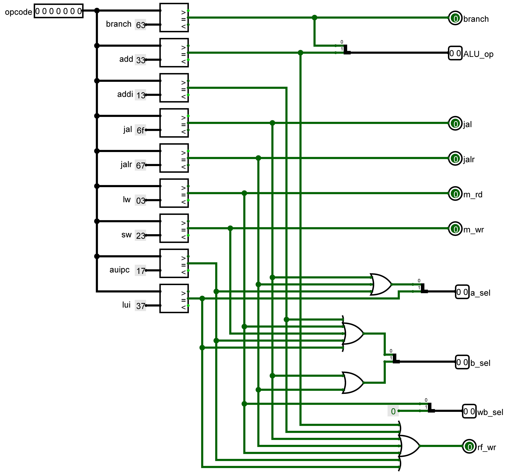

# RISC V Pipelened discrete CPU

using [logism](http://www.cburch.com/logisim/)


## Supported Instructions

instructions | comments
--- | --- |
`add t1, t2, t3` | set `t1` to `t2 + t3`
`sub t1, t2, t3` | set `t1` to `t2 - t3`
`addi t1, t2, -100` | set `t1` to `t2 + signed 12-bit immediate`
`and t1, t2, t3` | set `t1` to `t2 bitwise AND t3`
`or t1, t2, t3`  | set `t1` to `t2 bitwise OR t3`
`auipc t1, 1000000` | set `t1` to `pc + an upper 20-bit immediate`
`lui t1, 1000000` | set `t1` to `0 + an upper 20-bit immediate`
`beq t1, t2, label` | branch to `label` if `t1 == t2`
`bne t1, t2, label` | branch to `label` if `t1 != t2`
`blt t1, t2, label` | branch to `label` if `t1 < t2`
`bge t1, t2, label` | branch to `label` if `t1 >= t2`
`jal t1, target` | set `t1` to `pc`(return addr) and jump to `target`
`jalr t1, t2, -100` | set `t1` to `pc`(return addr) and jump to `t2 + immediate`
`lw t1, -100(t2)` | set `t1` to contents of effictive memory address
`sw t1, -100(t2)` | store `t1` to effective memory address

## Simulation

- Download and install Logism [here](https://sourceforge.net/projects/circuit/)
- Write assembly code

```asm
.text
	addi a0, x0, 5
```

- Get instructions hexa code and save it into a file

Can use [RARS](https://github.com/TheThirdOne/rars) for that purpose.

test.instr
-

```instr
v2.0 raw
00500513
```

- Load instructions into memory
    - right click on instruction memory circuit

    
    - select View instr MEM to see circuit implementation

    - right click on RAM memory

    
    - select Edit Contents and choose your instructions file to be loaded

- Use `clk` and `rst` button to debug

## Components

### PC


### Instructions Memory


### Register File


### Immediate Generator


### ALU


### Branch


### Data Memory


### Control



### ALU Control


### Forwarding Unit


### Hazard Detection Unit


